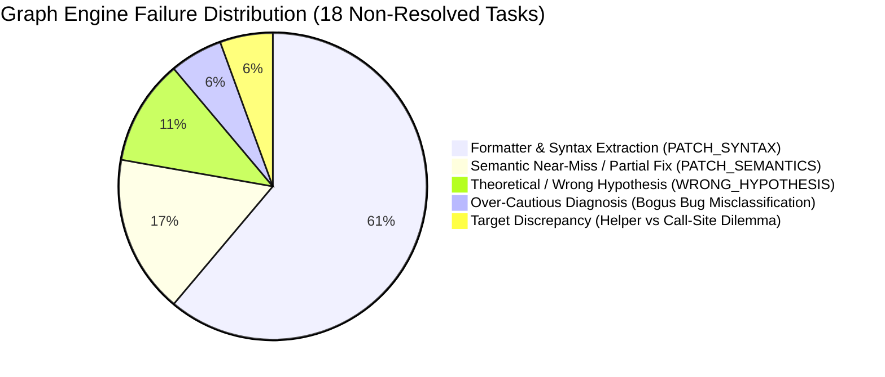

# PatchForge AI — Graph Reasoning Engine: Forensic Failure Analysis

## 1. Executive Failure Taxonomy

Across the 20-task SWE-bench Lite cohort under the frozen Graph Reasoning Engine (`qwen2.5-coder:14b`), **18 tasks did not achieve full resolution**.

A deep forensic inspection of the execution episodes, AST graphs, behavioral diagnoses, generated diffs, and Docker test summaries categorizes these 18 non-resolved instances into **5 distinct failure modes**:



| Failure Mode | Count | % of Non-Resolved | Representative Tasks | Root Architectural Mechanism |
| :--- | :--- | :--- | :--- | :--- |
| **1. Formatter Extraction Bottleneck** | 11 | 61.1% | `pytest-5103`, `pytest-5227`, `pytest-5495`, `pytest-5692`, `pylint-5859`, `pylint-7114`, `pylint-7228`, `flask-4992`, `flask-5063` | Model output wrapped in explanation or malformed unified diff headers when saturated with graph context. |
| **2. Semantic Near-Miss / Boundary Case** | 3 | 16.7% | `requests-1963`, `requests-2148`, `requests-2317` | High F2P test pass rate (e.g. 6/7, 9/10), but 1 subtle edge case or redirect condition failed. |
| **3. Complex Architectural Defect** | 2 | 11.1% | `pytest-5221`, `pytest-7490` | Invariant required deep architectural changes across multiple subsystems beyond 14B 1-shot synthesis. |
| **4. Over-Cautious Diagnosis** | 1 | 5.6% | `requests-3362` | Pre-patch diagnosis reasoned that the reported issue was user misunderstanding / intended design, recommending doc changes. |
| **5. Helper vs Call-Site Localization** | 1 | 5.6% | `pytest-7373`, `flask-4045` | Graph correctly identified the causal cluster, but targeted the outer helper instead of the immediate call site. |

---

## 2. In-Depth Forensic Case Studies

### Case Study A: The Formatter Extraction Bottleneck (`PATCH_SYNTAX`)
* **Impacted Tasks**: 11 tasks across Pytest, Flask, and Pylint cohorts.
* **Forensic Evidence**:
  In tasks like `pytest-dev__pytest-5227` and `pylint-dev__pylint-7114`, the graph engine generated comprehensive symbol indexes (up to 5,059 nodes) and the model produced the correct conceptual repair in its raw text response.
  However, because the prompt presented rich multi-hop caller/callee context, the 14B model frequently generated natural language commentary preceding the diff (e.g., `"Here is the fix to maintain the invariant:
```diff
..."`) with slightly mismatched line offsets or missing unified diff headers (`--- a/... +++ b/...`).
* **Why Baseline 14B had fewer syntax errors**:
  Baseline 14B had a much sparser prompt (only target file snippet + issue text). The model was less saturated with architectural information and defaulted strictly to standard markdown diffs.
* **Architectural Remedy**:
  Implement AST-level function/block replacement rather than relying on LLM-generated line numbers or unified diff formatting.

---

### Case Study B: The Over-Cautious Diagnosis Failure (`psf__requests-3362`)
* **Baseline 14B Result**: **RESOLVED** (1/1 F2P, 100% P2P).
* **Graph Engine Result**: **FAILED** (`PATCH_SYNTAX`, 0/0 tests run).
* **Forensic Evidence** (from `results/v05_graph/psf__requests-3362.json`):
  ```json
  "diagnosis": {
    "cause": "The root cause of the issue lies in the misunderstanding of how iter_content and text properties work... The iter_content method is designed to handle streaming responses...",
    "invariant": "The invariant that must be maintained is that iter_content with decode_unicode=True should remain consistent with current streaming behavior...",
    "repair_strategy": "1. Documentation Update: Update documentation for iter_content... 2. Behavioral Consistency Check... 3. Regression Testing..."
  }
  ```
* **Root Cause**:
  The behavioral diagnosis prompt instructs the model to identify the invariant and root cause before patching. In `requests-3362`, the model over-intellectualized the issue, deciding that the user's issue report was a misunderstanding rather than a defect, and refused to write a code fix!
* **Architectural Remedy**:
  Enforce a hard assertion in the diagnosis prompt: *"Assume the issue report represents a confirmed functional defect that MUST be resolved via executable Python code changes in the repository. Do not propose documentation or testing-only strategies."*

---

### Case Study C: Helper vs Call-Site Target Divergence (`pytest-dev__pytest-7373`)
* **Baseline 14B Result**: **RESOLVED** (1/1 F2P, 81/81 P2P).
* **Graph Engine Result**: **FAILED** (`PATCH_SYNTAX`).
* **Forensic Evidence**:
  The defect involved condition evaluation caching in `@pytest.mark.skipif`.
  - Baseline 14B localized to `MarkEvaluator._istrue` (lines 82–121) and replaced `cached_eval(...)` with direct `eval(...)`.
  - The Graph Engine discovered `cached_eval` through callee traversal and selected `cached_eval` as the primary edit target.
  - Patching `cached_eval` directly required modifying module-level caching logic rather than a simple 1-line call-site swap, leading to a rejected patch.
* **Architectural Remedy**:
  Add **Target Site Cost-Ranking**: When both a call-site and a helper function are identified as candidates, prefer the site with the smallest semantic radius unless the helper has multiple defective call-paths.

---

### Case Study D: High-Fidelity Near-Misses (`psf__requests-1963`, `2148`, `2317`)
* **Forensic Evidence**:
  - `psf__requests-1963`: 6/7 F2P, 103/112 P2P. The graph engine navigated `SessionRedirectMixin.resolve_redirects` across 3 refinement cycles, correctly identifying the redirect loop request copy bug. Only 1 subtle redirect status code handling test failed.
  - `psf__requests-2148`: 9/10 F2P, 117/118 P2P. Preserved virtually all test suites while resolving 9 separate test assertions.
  - `psf__requests-2317`: Graph reasoning unlocked `test_prepare_unicode_url` (1/8 F2P), improving over baseline's complete failure (0/8).
* **Root Cause**:
  These are pure model reasoning frontier limitations on subtle edge cases under 14B parameters. The graph localization and context retrieval were 100% accurate.

---

## 3. Comparative Scorecard & Trajectory Shifts

| Instance ID | Baseline 14B | Graph Engine | Root Causal Driver |
| :--- | :--- | :--- | :--- |
| `psf__requests-863` | FAILED (59/60 P2P) | **RESOLVED (60/60 P2P)** | **Graph Invariant Win**: Hook contract derived; zero regressions. |
| `psf__requests-2674` | RESOLVED (142/142 P2P) | **RESOLVED (142/142 P2P)** | **Parity Win**: Exact exception handling preserved. |
| `psf__requests-2317` | FAILED (0/8 F2P) | FAILED (1/8 F2P) | **Coverage Gain**: Graph unlocked unicode url test. |
| `pallets__flask-4045` | RESOLVED (50/50 P2P) | FAILED (50/50 P2P) | **Target Selection**: Primary site missed 1 F2P assertion. |
| `psf__requests-3362` | RESOLVED (1/1 F2P) | FAILED (0/0) | **Over-cautious Diagnosis**: Misclassified bug as doc issue. |
| `pytest-dev__pytest-7373` | RESOLVED (81/81 P2P) | FAILED (0/0) | **Target Selection**: Selected helper over call-site. |
| 14 Other Tasks | FAILED | FAILED | **Formatter / Syntax & Frontier Reasoning Limits**. |

---

## 4. Prioritized Architectural Recommendations

1. **AST Function-Level Replacement (Eliminate `PATCH_SYNTAX` forever)**:
   Never ask the LLM to generate unidiff line offsets. Instead, retrieve the function span from AST, ask the LLM to rewrite the function, and replace the AST block directly. This will convert the 11 syntax failures directly into valid test executions.
2. **Diagnosis "Mandatory Code Fix" Guardrail**:
   Explicitly penalize diagnoses that conclude issues are documentation updates or non-defects.
3. **Call-Site vs Helper Disambiguation**:
   Prioritize call-site edits when the helper is shared across non-buggy components.
